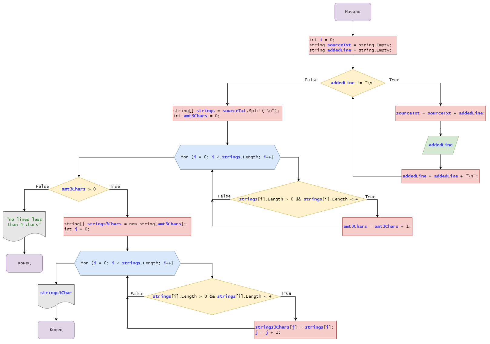

## Описание программы
Данная программа ожидает от пользователя ввод текста в консоли. Далее разбивает этот текст на отдельные строки и создаёт из них массив. И далее, либо выводит массив из строк, длина которых меньше либо равна 3 символа, либо сообщение о том, что таких строк нет.
## Код
Первый блок кода получает данные от пользователя и создаёт массив строк:
```
string sourceTxt = string.Empty;
string addedLine = string.Empty;
while (addedLine != "\n"){
    sourceTxt += addedLine;
    addedLine = Console.ReadLine() + "\n";
}
string[] strings = sourceTxt.Split("\n");
```
Переменная `sourceTxt` накапливает все строки введённые пользователем в цикле.  
Переменная `addedLine` сохраняет пользовательский ввод на каждом круге цикла. К ней добавляется символ перевода строки `\n` чтобы потом разбить строку по этим символам.  
На каждом круге цикла к строке `sourceTxt` добавляется `addedLine`.  
Когда пользователь закончит ввод, чтобы завершить цикл ввода, достаточно ввести пустую строку. К ней добавится символ `\n` и условие в цикле будет `False`.  
Далее создаётся массив строк `strings` методом `.Split("\n")` по символу `\n`.

Следующий блок кода считает сколько строк в массиве короче 4ёх символов:
```
int amt3Chars = 0;
for (i = 0; i < strings.Length; i++){
    if (strings[i].Length > 0 && strings[i].Length < 4){
        amt3Chars += 1;
    }
}
```
Переменная `amt3Chars` хранит в себе их количество.  
Пробегаем по массиву `strings` циклом ***for***, и проверяем, не короче ли 4ёх символов строка. Если короче, инкрементируем `amt3Chars`.

Следующий блок кода формирует массив строк, которые короче 4ёх символов, если такие строки есть, и выводит его в консоль:
```
if (amt3Chars > 0){
    string[] strings3Chars = new string[amt3Chars];
    int j = 0;
    for (i = 0; i < strings.Length; i++){
        if (strings[i].Length > 0 && strings[i].Length < 4){
            strings3Chars[j] = strings[i];
            j += 1;
        }
    }
    print_array(ref strings3Chars);
}
else {
    Console.Write("no lines less than 4 chars");
}
```
Сначала здесь проверяется, а есть ли строки короче 4ёх символов. Если переменная `amt3Chars` равна 0, то считаем, что строк короче 4ёх символов нет и выводим сообщение об этом `Console.Write("no lines less than 4 chars");`.  
Если `amt3Chars` > 0, то создаётся массив строк:  
`string[] strings3Chars = new string[amt3Chars];`  
размером, равному `amt3Chars`.  
Далее в этот массив копируются строки из массива `strings`, которые короче 4ёх символов, и далее этот массив выводится в консоль.
## Дополнительно
К этой программе прилагается блок-схема:  
